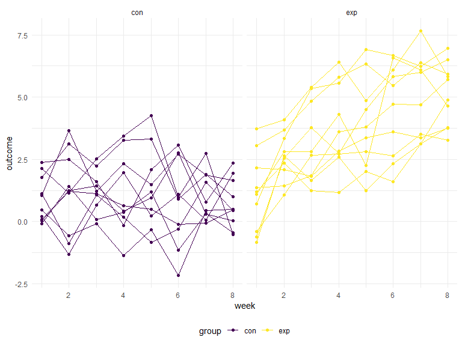
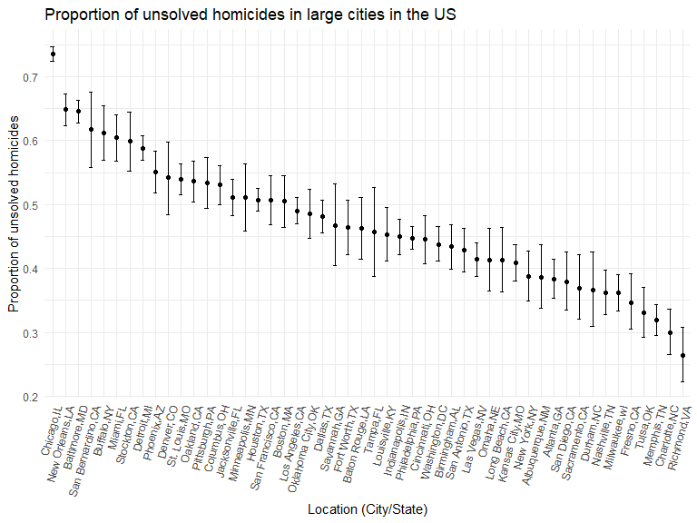
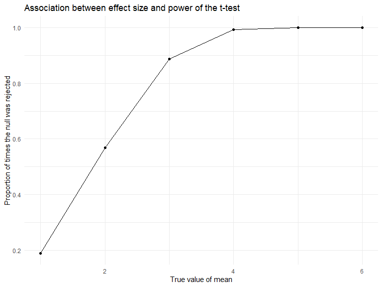
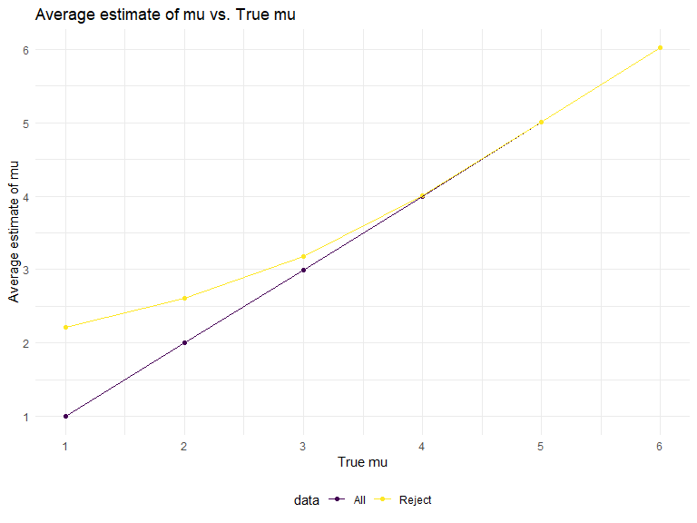

Homework 5
================
Suning Zhao
2022-11-16

## Problem 1

The code chunk below imports the data in individual spreadsheets
contained in `./data/zip_data/`. To do this, I create a dataframe that
includes the list of all files in that directory and the complete path
to each file. As a next step, I `map` over paths and import data using
the `read_csv` function. Finally, I `unnest` the result of `map`.

``` r
full_df = 
  tibble(
    files = list.files("data/zip_data/"),
    path = str_c("data/zip_data/", files)
  ) %>% 
  mutate(data = map(path, read_csv)) %>% 
  unnest()
```

The result of the previous code chunk isn’t tidy – data are wide rather
than long, and some important variables are included as parts of others.
The code chunk below tides the data using string manipulations on the
file, converting from wide to long, and selecting relevant variables.

``` r
tidy_df = 
  full_df %>% 
  mutate(
    files = str_replace(files, ".csv", ""),
    group = str_sub(files, 1, 3)) %>% 
  pivot_longer(
    week_1:week_8,
    names_to = "week",
    values_to = "outcome",
    names_prefix = "week_") %>% 
  mutate(week = as.numeric(week)) %>% 
  select(group, subj = files, week, outcome)
```

Finally, the code chunk below creates a plot showing individual data,
faceted by group.

``` r
tidy_df %>% 
  ggplot(aes(x = week, y = outcome, group = subj, color = group)) + 
  geom_point() + 
  geom_path() + 
  facet_grid(~group)
```



This plot suggests high within-subject correlation – subjects who start
above average end up above average, and those that start below average
end up below average. Subjects in the control group generally don’t
change over time, but those in the experiment group increase their
outcome in a roughly linear way.

## Problem 2

### Raw Data Import and Description

The code chunk below imports the data from github website. To do this, I
create a dataframe using `read_csv` to read the csv file. Then, I add a
new variable `city_state` to illustrate the city and state together.

``` r
homicides_raw_df = 
  read_csv("data/homicide-data.csv") %>% 
  janitor::clean_names() %>% 
  mutate(
    city_state = str_c(city,state,sep=",")
  )
```

-   The raw data includes 13 columns and 52179.
-   Important variables include uid, reported_date, victim_last,
    victim_first, victim_race, victim_age, victim_sex, city, state, lat,
    lon, disposition, city_state, which are used to describe the
    homicide in 50 cities across US.

### Summarize the total number of homicides and unsolved homicides

-   The code chunk below generates a table to summarize the total number
    of homicides and unsolved homicides in each cities.

``` r
homicides_count_df = 
  homicides_raw_df %>% 
  mutate(
    homicides_status = ifelse(disposition != "Closed by arrest", "unsolved", "solved")
    ) %>% 
  group_by(city_state) %>% 
  summarise(n_unsolved = sum(homicides_status == "unsolved"),
            n_total = n())

homicides_count_df %>% 
  knitr::kable(digits = 3) 
```

| city_state        | n_unsolved | n_total |
|:------------------|-----------:|--------:|
| Albuquerque,NM    |        146 |     378 |
| Atlanta,GA        |        373 |     973 |
| Baltimore,MD      |       1825 |    2827 |
| Baton Rouge,LA    |        196 |     424 |
| Birmingham,AL     |        347 |     800 |
| Boston,MA         |        310 |     614 |
| Buffalo,NY        |        319 |     521 |
| Charlotte,NC      |        206 |     687 |
| Chicago,IL        |       4073 |    5535 |
| Cincinnati,OH     |        309 |     694 |
| Columbus,OH       |        575 |    1084 |
| Dallas,TX         |        754 |    1567 |
| Denver,CO         |        169 |     312 |
| Detroit,MI        |       1482 |    2519 |
| Durham,NC         |        101 |     276 |
| Fort Worth,TX     |        255 |     549 |
| Fresno,CA         |        169 |     487 |
| Houston,TX        |       1493 |    2942 |
| Indianapolis,IN   |        594 |    1322 |
| Jacksonville,FL   |        597 |    1168 |
| Kansas City,MO    |        486 |    1190 |
| Las Vegas,NV      |        572 |    1381 |
| Long Beach,CA     |        156 |     378 |
| Los Angeles,CA    |       1106 |    2257 |
| Louisville,KY     |        261 |     576 |
| Memphis,TN        |        483 |    1514 |
| Miami,FL          |        450 |     744 |
| Milwaukee,wI      |        403 |    1115 |
| Minneapolis,MN    |        187 |     366 |
| Nashville,TN      |        278 |     767 |
| New Orleans,LA    |        930 |    1434 |
| New York,NY       |        243 |     627 |
| Oakland,CA        |        508 |     947 |
| Oklahoma City,OK  |        326 |     672 |
| Omaha,NE          |        169 |     409 |
| Philadelphia,PA   |       1360 |    3037 |
| Phoenix,AZ        |        504 |     914 |
| Pittsburgh,PA     |        337 |     631 |
| Richmond,VA       |        113 |     429 |
| Sacramento,CA     |        139 |     376 |
| San Antonio,TX    |        357 |     833 |
| San Bernardino,CA |        170 |     275 |
| San Diego,CA      |        175 |     461 |
| San Francisco,CA  |        336 |     663 |
| Savannah,GA       |        115 |     246 |
| St. Louis,MO      |        905 |    1677 |
| Stockton,CA       |        266 |     444 |
| Tampa,FL          |         95 |     208 |
| Tulsa,AL          |          0 |       1 |
| Tulsa,OK          |        193 |     583 |
| Washington,DC     |        589 |    1345 |

### Estimate proprotion of homicides that are unsloved for Baltimore, MD

-   The code chunk below use `prop.test` function and `broom::tidy` to
    estimate the proportion of homicides that are unsolved in Baltimore,
    MD.

``` r
baltimore_count_df = 
  homicides_count_df %>% 
  filter(city_state == "Baltimore,MD")

prop_test = 
  prop.test(
    x = baltimore_count_df %>% pull(n_unsolved), 
    n = baltimore_count_df %>% pull(n_total)) 

baltimore_prop_df = 
  broom::tidy(prop_test) %>% 
  rename(
    lower_limit = conf.low,
    upper_limit = conf.high
  )

baltimore_prop_df %>% 
  select(estimate, lower_limit, upper_limit) %>% 
  knitr::kable(digits = 3)
```

| estimate | lower_limit | upper_limit |
|---------:|------------:|------------:|
|    0.646 |       0.628 |       0.663 |

-   From the result we can know that the estimated proportion of
    homicides that are unsolved in Baltimore is 0.646, with a confidence
    interval between 0.628 and 0.663

### Estimate proprotion of homicides that are unsloved for all cities

-   The code chunk below use `prop.test` function, `map2` and
    `broom::tidy` to estimate the proportion of homicides that are
    unsovled in all cities.

``` r
homicides_test_df = 
  homicides_count_df %>%
  mutate(
      prop_test = map2(n_unsolved, n_total, ~ prop.test(.x, .y) %>%
      broom::tidy())) %>%
  unnest(prop_test) %>%
  rename(
    lower_limit = conf.low,
    upper_limit = conf.high
  ) %>% 
  select(city_state, estimate, lower_limit, upper_limit)

homicides_test_df %>% 
  knitr::kable(digits = 3)
```

| city_state        | estimate | lower_limit | upper_limit |
|:------------------|---------:|------------:|------------:|
| Albuquerque,NM    |    0.386 |       0.337 |       0.438 |
| Atlanta,GA        |    0.383 |       0.353 |       0.415 |
| Baltimore,MD      |    0.646 |       0.628 |       0.663 |
| Baton Rouge,LA    |    0.462 |       0.414 |       0.511 |
| Birmingham,AL     |    0.434 |       0.399 |       0.469 |
| Boston,MA         |    0.505 |       0.465 |       0.545 |
| Buffalo,NY        |    0.612 |       0.569 |       0.654 |
| Charlotte,NC      |    0.300 |       0.266 |       0.336 |
| Chicago,IL        |    0.736 |       0.724 |       0.747 |
| Cincinnati,OH     |    0.445 |       0.408 |       0.483 |
| Columbus,OH       |    0.530 |       0.500 |       0.560 |
| Dallas,TX         |    0.481 |       0.456 |       0.506 |
| Denver,CO         |    0.542 |       0.485 |       0.598 |
| Detroit,MI        |    0.588 |       0.569 |       0.608 |
| Durham,NC         |    0.366 |       0.310 |       0.426 |
| Fort Worth,TX     |    0.464 |       0.422 |       0.507 |
| Fresno,CA         |    0.347 |       0.305 |       0.391 |
| Houston,TX        |    0.507 |       0.489 |       0.526 |
| Indianapolis,IN   |    0.449 |       0.422 |       0.477 |
| Jacksonville,FL   |    0.511 |       0.482 |       0.540 |
| Kansas City,MO    |    0.408 |       0.380 |       0.437 |
| Las Vegas,NV      |    0.414 |       0.388 |       0.441 |
| Long Beach,CA     |    0.413 |       0.363 |       0.464 |
| Los Angeles,CA    |    0.490 |       0.469 |       0.511 |
| Louisville,KY     |    0.453 |       0.412 |       0.495 |
| Memphis,TN        |    0.319 |       0.296 |       0.343 |
| Miami,FL          |    0.605 |       0.569 |       0.640 |
| Milwaukee,wI      |    0.361 |       0.333 |       0.391 |
| Minneapolis,MN    |    0.511 |       0.459 |       0.563 |
| Nashville,TN      |    0.362 |       0.329 |       0.398 |
| New Orleans,LA    |    0.649 |       0.623 |       0.673 |
| New York,NY       |    0.388 |       0.349 |       0.427 |
| Oakland,CA        |    0.536 |       0.504 |       0.569 |
| Oklahoma City,OK  |    0.485 |       0.447 |       0.524 |
| Omaha,NE          |    0.413 |       0.365 |       0.463 |
| Philadelphia,PA   |    0.448 |       0.430 |       0.466 |
| Phoenix,AZ        |    0.551 |       0.518 |       0.584 |
| Pittsburgh,PA     |    0.534 |       0.494 |       0.573 |
| Richmond,VA       |    0.263 |       0.223 |       0.308 |
| Sacramento,CA     |    0.370 |       0.321 |       0.421 |
| San Antonio,TX    |    0.429 |       0.395 |       0.463 |
| San Bernardino,CA |    0.618 |       0.558 |       0.675 |
| San Diego,CA      |    0.380 |       0.335 |       0.426 |
| San Francisco,CA  |    0.507 |       0.468 |       0.545 |
| Savannah,GA       |    0.467 |       0.404 |       0.532 |
| St. Louis,MO      |    0.540 |       0.515 |       0.564 |
| Stockton,CA       |    0.599 |       0.552 |       0.645 |
| Tampa,FL          |    0.457 |       0.388 |       0.527 |
| Tulsa,AL          |    0.000 |       0.000 |       0.945 |
| Tulsa,OK          |    0.331 |       0.293 |       0.371 |
| Washington,DC     |    0.438 |       0.411 |       0.465 |

### Creat a plot to show the estimates and CIs for each city

-   The code chunk below use `ggplot` to generate a plot to show the
    estimated proportion of unsolved homicides for each city.
-   We used `geom_errorbar` to create the plot. The cities are organized
    accroding to the proportion of unsolved homicides.

``` r
homicides_test_df %>%
  mutate(
    city_state = fct_reorder(city_state, estimate, .desc = TRUE)) %>% 
  ggplot(aes(x = city_state, y = estimate)) +
  geom_point() +
  geom_errorbar(aes(ymin = lower_limit, ymax = upper_limit, width = .3)) +
  theme(axis.text.x = element_text(angle = 75, hjust = 1), legend.position = "none") +
  labs(
    title = "Proportion of unsolved homicides in large cities in the US",
    x = "Location (City/State)",
    y = "Proportion of unsolved homicides"
  )
```



## Problem 3

### Set design elements:

According to the requirement, build a function for t-test, based on a
random selected dataset from normal distribution that fix n = 30 and
sigma = 5

``` r
t_test = function(n = 30, mu, sigma = 5) {
  simulation_data = tibble(
    x = rnorm(n = 30, mean = mu, sd = sigma)
  )
  simulation_data %>% 
    t.test(mu = 0, conf.level = 0.95, alternative = c("two.sided")) %>%
    broom::tidy() %>% 
    select(estimate, p.value)
}
```

### Test when u = 0. Generate 5000 datasets.

``` r
simulation_df_0 = 
  expand_grid(
    mu = 0,
    iterate = 1:5000) %>% 
  mutate(
    t_test_df = map(.x = mu, ~t_test(mu = .x))
    ) %>%
  unnest(t_test_df)
```

### Repeat test for u = 1:6

``` r
simulation_df = 
  expand_grid(
    mu = c(1:6),
    iterate = 1:5000) %>% 
  mutate(
    t_test_df = map(.x = mu, ~t_test(mu = .x))
    ) %>%
  unnest(t_test_df) %>% 
  rename(p_value = p.value)
```

### Making Plots showing the proportion of times the null was rejected

``` r
simulation_df = 
 simulation_df %>% 
  mutate(
    reject = if_else(p_value < 0.05, "Reject", "Fail")) 

simulation_df %>% 
  group_by(mu, reject) %>%
  summarize(
    num_reject = n()) %>%
  mutate(
    prop_reject = num_reject/5000) %>% 
  filter(reject == "Reject") %>%
  ggplot(
    aes(x = mu, y = prop_reject)) +
  geom_point() + 
  geom_line() + 
  labs(
    title = "Association between effect size and power of the t-test",
    x = "True value of mean",
    y = "Proportion of times the null was rejected"
  )
```

    ## `summarise()` has grouped output by 'mu'. You can override using the `.groups`
    ## argument.



-   Based on the result, we can know that as the true mean increases,
    the proportion of times the null was rejected also increases. It is
    approaching to 1 when the true mean is closing to 6.
-   Since the power of the test is the proportion of times the null was
    rejected and the effect size is the difference between true mean and
    0, we can know that the larger the effect size is, the higher the
    power of test is.

### Make a plot showing the average estimate of mu on the y axis and the true value of u on the x axis

``` r
average_total = 
  simulation_df %>%
  group_by(mu) %>% 
  summarize(
    estimate_avg = mean(estimate)
    ) %>% 
  mutate(data = "All")

average_reject = 
  simulation_df %>%
  filter(reject == "Reject") %>% 
  group_by(mu) %>% 
  summarize(
    estimate_avg = mean(estimate)
    ) %>% 
  mutate(data = "Reject")

simulation_average = bind_rows(average_total, average_reject)

simulation_average %>% 
ggplot(aes(x = mu, y = estimate_avg, color = data)) +
  geom_point() + 
  geom_path() +
  scale_x_continuous( breaks = 1:6 ) +
  scale_y_continuous( breaks = 1:6 ) +
  labs(
    title = "Average estimate of mu vs. True mu",
    x = "True mu",
    y = "Average estimate of mu"
  ) + 
  theme(legend.position = "bottom")
```



-   According to the graph, we can know that when mu is less than 3, the
    sample average of mu across tests for which the null is rejected is
    higher than true value of mu.
-   When mu is higher than 4, it is suggested that the sample average of
    mu across tests for which the null is rejected is approximately
    equal to the true value of mu.
-   From last graph we can know that the power is relatively lower when
    mu is less than 3. That is the reason why the sample average is
    higher than the true value of mu when mu is less than 3. Under a
    lower power, the estimates of mu is not precise, which we should pay
    attention in statistical analysis.
